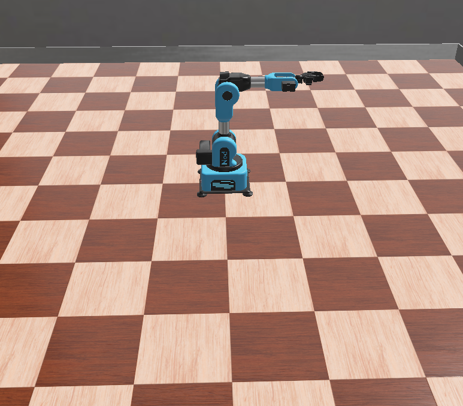
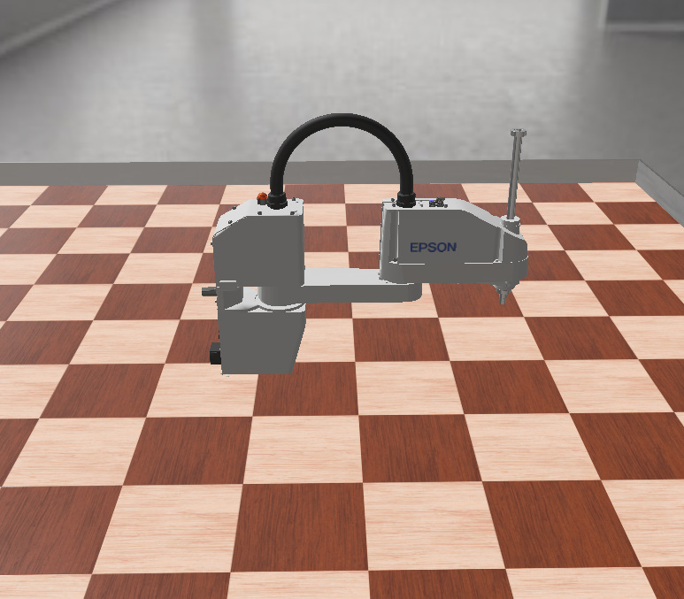
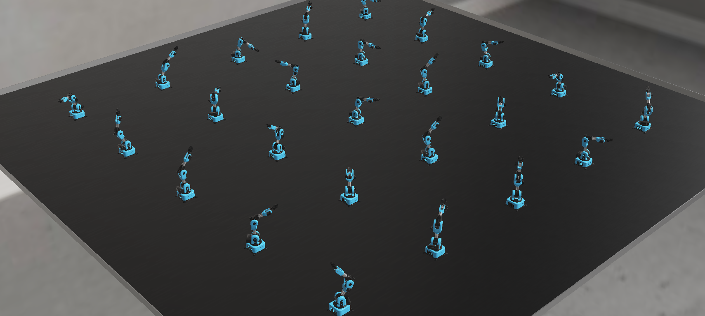
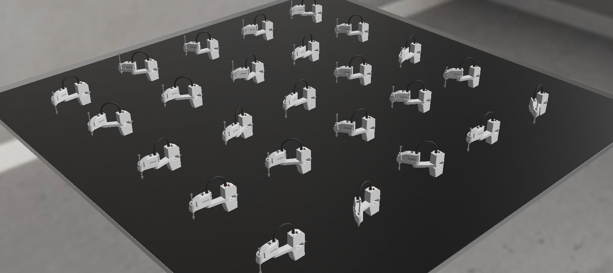

# Robotics-01

Webots simulations for exploring robot kinematics with a **Niryo NED** arm and an **Epson SCARA T6** robot. The project includes single-robot forward-kinematics experiments, parallel data collection with 25 robots, and starter worlds for inverse-kinematics work.

The forward-kinematics experiments command joint positions and measure the resulting hand position with a simulated GPS sensor. The swarm collection routines pair measured joint positions with hand coordinates relative to each robot's base and save them to CSV.

[Media](#media) · [Project structure](#project-structure) · [Version control](#version-control) · [Getting started](#getting-started) · [Datasets](#datasets) · [Configuration](#configuration) · [Tests](#tests) · [Current limitations](#current-limitations)

## Project overview

| Area | What it contains | Current status |
| --- | --- | --- |
| Forward kinematics | One NED or SCARA robot, fixed-target controllers, and random-point generators | Implemented; worlds select the random-point generators by default |
| Swarm data collection | Separate NED and SCARA worlds, each with a 5 × 5 grid of robots | Collection routines, CSV export, and datasets included |
| Inverse kinematics | NED and SCARA world layouts | Starter files; inverse-kinematics controllers are not implemented |

Each swarm world has 25 independently controlled robots, 1.5 m spacing, a 9 × 9 m floor, and an 8 ms physics timestep. Here, “swarm” means parallel sampling by multiple arms; the controllers do not implement coordination between robots.

## Media

### Single-robot simulations

| NED forward kinematics | SCARA forward kinematics |
| --- | --- |
|  |  |

### NED swarm



<video controls playsinline preload="metadata" width="800" poster="media/ned-forward-kinematics-swarm.png">
  <source src="media/ned-forward-kinematics-swarm_1.mp4" type="video/mp4">
  <a href="media/ned-forward-kinematics-swarm_1.mp4">
    
  </a>
</video>

[Watch or download the NED swarm video (MP4)](media/ned-forward-kinematics-swarm_1.mp4).

### SCARA swarm



<video controls playsinline preload="metadata" width="800" poster="media/scara-forward-kinematics-swarm.png">
  <source src="media/scara-forward-kinematics-swarm.mp4" type="video/mp4">
  <a href="media/scara-forward-kinematics-swarm.mp4">
    
  </a>
</video>

[Watch or download the SCARA swarm video (MP4)](media/scara-forward-kinematics-swarm.mp4).

Press **Play** to watch either recording directly in a Markdown viewer that supports HTML video. Both players load their MP4 files and preview images from `media/`. Viewers that disable embedded video may show only the fallback links; use those links to open or download the recordings.

## Project structure

```text
Robotics-01/
├── .gitignore                          # Local settings, caches, and test outputs
├── README.md
├── media/                              # Four screenshots and two swarm recordings
├── Robots-Forward-Kinematics/
│   ├── NED/
│   │   ├── controllers/
│   │   │   ├── ned-forward-kinematics-controller/
│   │   │   └── ned-forward-kinematics-random-point-generator/
│   │   ├── protos/NedWithGPS.proto
│   │   └── worlds/ned-forward-kinematics.wbt
│   └── SCARA/
│       ├── controllers/
│       │   ├── scara/                  # Keyboard-controller experiment
│       │   ├── scara-forward-kinematics-controller/
│       │   └── scara-forward-kinematics-random-point-generator/
│       └── worlds/scara-forward-kinematics.wbt
├── Robots-Inverse-Kinematics/
│   ├── NED/
│   │   ├── protos/NedWithGPS.proto
│   │   └── worlds/ned-inverse-kinematics.wbt
│   └── SCARA/
│       └── worlds/scara-inverse-kinematics.wbt
└── Robots-Swarm/
    ├── NED/
    │   ├── README.md
    │   ├── controllers/ned-swarm-data-generator/
    │   │   ├── ned-swarm-data-generator.py
    │   │   └── ned_dataset.csv
    │   ├── protos/NedWithGPS.proto
    │   ├── tests/test_ned_swarm_data_generator.py
    │   └── worlds/ned-forward-kinematics-swarm.wbt
    └── SCARA/
        ├── README.md
        ├── controllers/scara-swarm-data-generator/
        │   ├── scara-swarm-data-generator.py
        │   └── scara_dataset.csv
        ├── protos/ScaraWithGPS.proto
        ├── tests/test_scara_swarm_data_generator.py
        └── worlds/scara-forward-kinematics-swarm.wbt
```

Each robot folder is a separate Webots project:

- **`worlds/`** contains `.wbt` scenes: the arena, robot placement, physics settings, and selected controllers.
- **`controllers/`** contains Python programs. Each controller's directory and `.py` file share the controller name used by the world.
- **`protos/`** contains local robot definitions. The NED variants add GPS at the hand-link origin; the swarm SCARA variant adds GPS at the hand-slot origin and exposes simulation settings. The single-robot SCARA world uses the upstream model and adds GPS through its hand slot.
- **`tests/`** contains Python regression checks using simulated devices, so Webots does not need to be open.

Webots workspace settings, preview files, and operating-system metadata are omitted from the tree.

## Version control

The root [`.gitignore`](.gitignore) excludes operating-system metadata, Python caches and virtual environments, local editor settings, logs, and Webots' hidden workspace settings and generated world thumbnails. These files can remain on your computer without appearing as project changes.

The rules also ignore `ned_dataset.csv` and `scara_dataset.csv` **at the repository root**, where the regression tests can write temporary samples. The datasets inside the swarm controller folders, all screenshots and videos in `media/`, Python controllers, `.wbt` worlds, and `.proto` models remain tracked.

Normal swarm runs append to the tracked controller-folder datasets, so those changes still appear in Git. Set a different `CSV_FILENAME` before collecting a separate run if you want to preserve the supplied datasets.

## Getting started

### Requirements

- **[Webots R2025a](https://github.com/cyberbotics/webots/releases/tag/R2025a)**, matching the version declared by the worlds and robot models.
- **Python 3**, configured as the Python interpreter used by Webots. Controllers use the Webots `controller` API and Python's standard library; no additional Python packages are required by the current code.
- **An internet connection on first load**, because the worlds and local robot definitions reference versioned Webots models, meshes, and textures online.
- **macOS or Linux for the swarm controllers and their tests.** CSV writing uses Python's Unix-only [`fcntl`](https://docs.python.org/3/library/fcntl.html) module; native Windows requires a replacement for this locking mechanism.

### Run a single-robot experiment

1. Download or clone the complete repository, keeping its directory structure intact.
2. Open Webots and select one of the forward-kinematics worlds below.
3. Press **Run** and inspect the Webots console for joint targets and measured hand positions.
4. To change behavior, edit the Python controller or select another controller in the robot's `controller` field. Save and reload the world after changes.

| Experiment | World to open |
| --- | --- |
| NED, single robot | [ned-forward-kinematics.wbt](Robots-Forward-Kinematics/NED/worlds/ned-forward-kinematics.wbt) |
| SCARA, single robot | [scara-forward-kinematics.wbt](Robots-Forward-Kinematics/SCARA/worlds/scara-forward-kinematics.wbt) |
| NED, 25 robots | [ned-forward-kinematics-swarm.wbt](Robots-Swarm/NED/worlds/ned-forward-kinematics-swarm.wbt) |
| SCARA, 25 robots | [scara-forward-kinematics-swarm.wbt](Robots-Swarm/SCARA/worlds/scara-forward-kinematics-swarm.wbt) |

The single-robot `*-random-point-generator` controllers sample 1,000 targets and print GPS positions in **world coordinates**. The `*-controller` alternatives command one fixed target and print the final position once the hand stops moving. Review their target values before use; the SCARA fixed-target example currently sets its slide outside the model's travel range.

Launch controllers through Webots so it supplies the simulation connection and `controller` module.

### Starting swarm collection

Open one of the swarm worlds listed above and press **Run**. Every robot launches its own copy of the [NED controller](Robots-Swarm/NED/controllers/ned-swarm-data-generator/ned-swarm-data-generator.py) or [SCARA controller](Robots-Swarm/SCARA/controllers/scara-swarm-data-generator/scara-swarm-data-generator.py). Start at `run(robot)` when reading either script. Each robot's collection routine:

1. Chooses a random target for its three varying joints.
2. Waits until all controlled joints reach their targets and the hand remains still for 0.5 simulated seconds.
3. Reads the measured joint positions and converts GPS coordinates into that robot's base frame.
4. Appends an accepted sample to the shared CSV and prints progress to the console.
5. Holds the final pose after reaching its sample count while the other robots finish.

The default is **1,000 accepted samples per robot**, giving **25,000 new rows per complete swarm run**. The writer appends to existing files. To keep a run separate, set a new `CSV_FILENAME` before launching the controllers.

See the [NED guide](Robots-Swarm/NED/README.md) and [SCARA guide](Robots-Swarm/SCARA/README.md) for robot-specific simulation settings, output details, and regression checks.

## Datasets

The repository includes two CSV datasets, each currently containing **25,000 data rows**, excluding the header:

| Robot | Dataset | Robot flags |
| --- | --- | --- |
| NED | [ned_dataset.csv](Robots-Swarm/NED/controllers/ned-swarm-data-generator/ned_dataset.csv) | `is_scara=0`, `is_ned=1` |
| SCARA | [scara_dataset.csv](Robots-Swarm/SCARA/controllers/scara-swarm-data-generator/scara_dataset.csv) | `is_scara=1`, `is_ned=0` |

Both use this header:

```csv
is_scara,is_ned,q1,q2,q3,x,y,z
```

| Column | Meaning | Unit |
| --- | --- | --- |
| `is_scara`, `is_ned` | Robot-type indicators | `0` or `1` |
| `q1`, `q2` | Measured positions of the first two rotating joints | Radians |
| `q3` | NED's third rotating joint, or SCARA's vertical slide | NED: radians; SCARA: metres |
| `x`, `y`, `z` | GPS hand position relative to the robot's base | Metres |

**SCARA's third input is a distance, not an angle.** A value of `-0.10` commands a downward slide displacement of 10 cm. Preserve the robot-type flags when combining datasets because `q3` has different units for the two robots.

The swarm routines save **measured joint values**, rather than requested targets. They remove each robot's world translation and rotation using:

```text
p_base = transpose(R_base) × (p_world - t_base)
```

For the unrotated, ground-level swarm bases, Z is the hand GPS height above the floor, while X and Y exclude the robot's grid offset. Do not subtract another grid or height offset. Single-robot console readings remain in world coordinates and should be converted before combining them with swarm data.

The CSV filename is relative to the controller's working directory. Files from normal Webots runs are stored beside the respective controller scripts, as in the links above. All robots of one type append to the same file using an exclusive file lock. Rows contain no robot-instance identifier, timestamp, or run identifier, so their order does not identify which arm produced them.

## Configuration

Edit settings near the top of the relevant swarm controller, then reload the world.

| Setting | NED | SCARA |
| --- | --- | --- |
| Samples per robot | `loop_value = 1000` | `loop_value = 1000` |
| Varying joint limits | `ROTATION_LIMITS` | `JOINT_LIMITS` |
| `q1` target range | −2.7 to 2.7 rad | −0.73 to 0.73 rad |
| `q2` target range | −0.7 to 0.4 rad | −0.83 to 0.83 rad |
| `q3` target range | −1.4 to 0.8 rad | −0.15 to 0 m |
| Remaining joints | Joints 4–6 held at zero | Shaft rotation held at zero |
| Output filename | `CSV_FILENAME = "ned_dataset.csv"` | `CSV_FILENAME = "scara_dataset.csv"` |
| Continuous settling time | `SETTLE_TIME_MS = 500` | `SETTLE_TIME_MS = 500` |
| Deadline per movement | `MOVE_TIMEOUT_MS = 20000` | `MOVE_TIMEOUT_MS = 20000` |

These are dataset sampling ranges for the current floor-level setups, rather than the robots' full mechanical travel. Recheck floor and self-collision clearance when widening the ranges or changing the tool or base placement.

A timed-out movement is rejected and replaced. Invalid readings, five consecutive failed moves, or reaching three attempts per requested sample without collecting enough data stop the routine with an error. Joint-position, joint-speed, and hand-speed checks determine when a pose is accepted.

The single-robot random generators use older, wider ranges and a simpler GPS-only settling check. Their loops currently use `range(1000)` directly, so editing `loop_value` alone does not change their sample count.

## Tests

Run the existing regression suites from the repository root:

```sh
python3 -B -m unittest discover -s Robots-Swarm/NED/tests -v
python3 -B -m unittest discover -s Robots-Swarm/SCARA/tests -v
```

The tests exercise coordinate transforms, settling checks, timeouts, completion, and device handling; SCARA also has checks for slide units and tolerances. They use fake devices and do not require a running Webots simulation. Collection tests can create or append `ned_dataset.csv` and `scara_dataset.csv` in the current working directory; use a temporary working directory with absolute test paths to isolate those outputs.

**Current test status:** on 2026-09-26, the NED suite ran 19 tests and reported 9 failures; SCARA ran 25 tests and reported 12 failures, including failing subtests. Failures include expectations for older console/error messages and shutdown motor-command counts. The suites are not currently passing and do not establish that the current scripts run successfully in Webots.

## Current limitations

- **Inverse kinematics is unfinished.** The [NED](Robots-Inverse-Kinematics/NED/worlds/ned-inverse-kinematics.wbt) and [SCARA](Robots-Inverse-Kinematics/SCARA/worlds/scara-inverse-kinematics.wbt) starter worlds still reference forward-kinematics controller names, but those controllers are absent from their own project folders.
- **The single-robot examples need cleanup.** The SCARA fixed-target controller uses `q3 = -1.0 m`; its random generator has an outdated millimetre comment and a NED label in its output.

## Model credits

Robot models and scene assets originate from Cyberbotics Webots, including Niryo NED and Epson SCARA T6 models. Local PROTO files retain their source and license notices: the NED model carries the Webots asset license, and the SCARA variant carries an Apache 2.0 notice. The repository currently has no top-level license file; those individual notices should be retained when reusing the assets.
